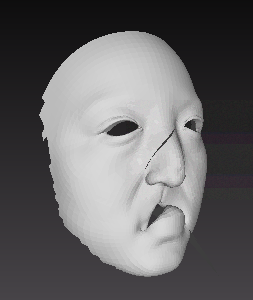

# laplacian_deformation_matlab
a matlab version laplacian deformation deformation
the code is based on https://www.mathworks.com/matlabcentral/fileexchange/61599-laplacian_surface_editing_3d  
It turns out there's something wrong with the result  
###the result  
origin img  
  
the result img  
 
